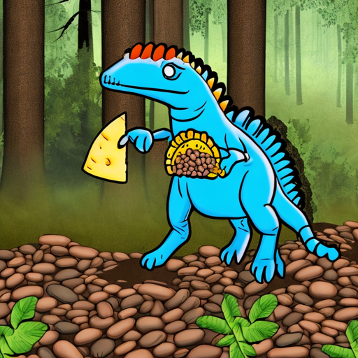
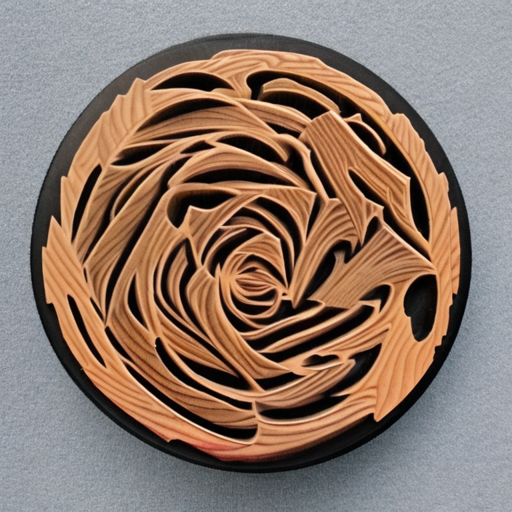
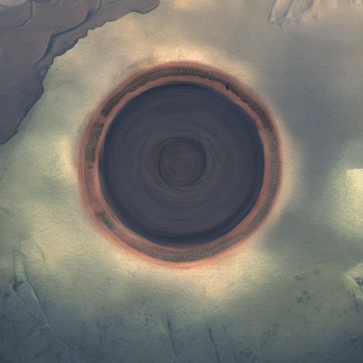
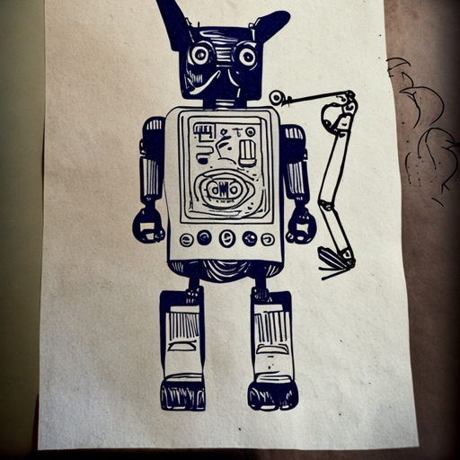
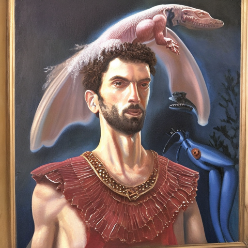
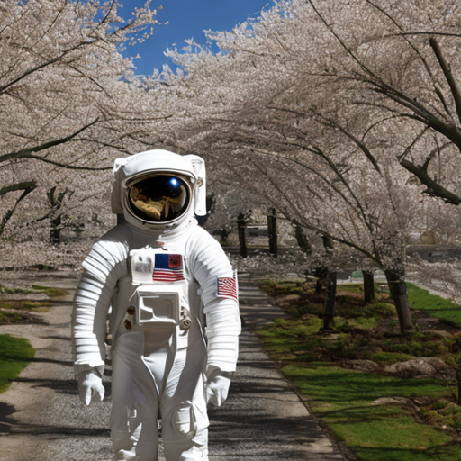
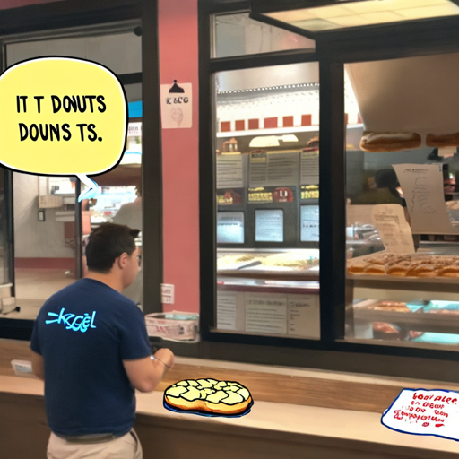

## About Project

The objective of this competition is to invert the conventional approach of a generative text-to-image model. Rather than generating an image based on a text prompt, the aim is to generate a textual description or caption that accurately represents a given image.

The objective of this project is to develop a model that predicts the text prompt based on a generated image. The model will be trained and evaluated on a diverse dataset consisting of pairs of prompts and images generated by Stable Diffusion 2.0. The goal is to assess the reversibility of the latent relationship between the images and their corresponding prompts.

<table>
    <tr>
        <th>
Image
</th>
        <th>
Prompt
</th>
    </tr>
    <tr>
        <td>

</td>
        <td>
<code>digital illustration of a blue dinosaur with a piece of cheese in its mouth walking through a forest</code>
</td>
    </tr>
    <tr>
        <td>

</td>
        <td>
<code>a close up wood carving shoeing the texture of wood</code>
</td>
    </tr>
    <tr>
        <td>

</td>
        <td>
<code>digital art selected for the #</code>
</td>
    </tr>
    <tr>
        <td>

</td>
        <td>
<code>a drawing of robot</code>
</td>
    </tr>
    <tr>
        <td>

</td>
        <td>
<code>a painting of a roman man with a lizard crawling over his shoulder</code>
</td>
    </tr>
    <tr>
        <td>

</td>
        <td>
<code>astronaut walking on a road lined with cherry blossom trees</code>
</td>
    </tr>
    <tr>
        <td>

</td>
        <td>
<code>a man in a blue tshirt and khakhi pants stands in front of a bakery counter</code>
</td>
    </tr>
</table>

## Methodology

Our ensemble method consists of combining three different models: the Vision Transformer (ViT) model, the CLIP Interrogator, and the OFA model fine-tuned for image captioning. We allocate different ratios to each model based on their relative performance and importance in the ensemble.

The updated ratio for each model in the ensemble is as follows:

Vision Transformer (ViT) model: 74.88%
CLIP Interrogator: 21.12%
OFA model fine-tuned for image captioning: 4%

## References

[1] [Learning Transferable Visual Models From Natural Language Supervision](https://arxiv.org/pdf/2103.00020.pdf)

[2] [An Image is Worth 16x16 Words: Transformers for Image Recognition at Scale](https://arxiv.org/pdf/2010.11929.pdf)

[3] [Very Deep Convolutional Networks for Large-Scale Image Recognition](https://arxiv.org/pdf/1409.1556.pdf)

[4] [SentenceTransformers](https://www.sbert.net/)

[5] [CLIPInterrogator + OFA + ViT](https://www.kaggle.com/code/motono0223/clipinterrogator-ofa-vit)

[6] [Swin Transformer: Hierarchical Vision Transformer using Shifted Windows](https://arxiv.org/pdf/2103.14030.pdf)

[7] [CoCa: Contrastive Captioners are Image-Text Foundation Models](https://arxiv.org/pdf/2205.01917.pdf)
